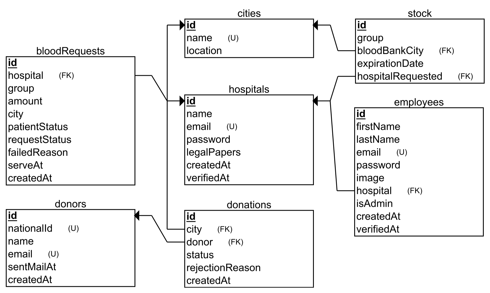

# Central blood bank management system

## Table of Contents

- [Central blood bank management system](#central-blood-bank-management-system)
  - [Table of Contents](#table-of-contents)
  - [1. Introduction](#1-introduction)
  - [2. Project Structure](#2-project-structure)
  - [3. Use Case](#3-use-case)
  - [4. User Story](#4-user-story)
    - [Admin](#admin)
    - [Hospital](#hospital)
    - [Employee](#employee)
  - [5. ERD](#5-erd)

## 1. Introduction
The Central Blood Bank Management System is a software solution designed to efficiently manage the processes involved in blood donation, stock management, and allocation to hospitals. This system aims to streamline the blood management process, enhance donor registration, ensure timely allocation of blood to hospitals, and improve overall efficiency in the blood supply chain.

## 2. Project Structure
The project follows a client-server architecture, with the server implemented using Node.js and the client implemented using React. Here is an overview of the main components and entities within the project:

- **Donors**: Donors are individuals who voluntarily donate blood. They can register their personal information, including their national ID, full name, city, and email. Donors play a crucial role in the blood bank management system by providing a steady supply of blood for potential transfusions.
- **Donations**: Donations represent the act of a donor giving blood. Donations need to fulfill certain conditions, such as a minimum time difference (at least 3 months) since the last donation and a negative blood virus test result, in order to be accepted and added to the stock.
- **Stock**: The stock refers to the inventory of available blood units in the blood bank. It includes information about the blood type, city of the blood bank, and expiration date of each unit. Accepted donations are added to the stock, and the stock is continuously managed and updated as units expire or are used for fulfilling blood requests from hospitals.
- **Hospitals**: Hospitals are entities that can request blood units from the blood bank to meet the needs of their patients. They can submit blood requests specifying the required blood type, location (city), and urgency level (Immediate, Urgent, Normal). The system aims to respond to the maximum possible number of requests with the least distance difference between the donation city and the hospital city.
- **Blood Requests**: Blood requests are submitted by hospitals to the blood bank management system. Each request includes information about the required blood type, location (city), and urgency level. The system processes the requests and aims to fulfill them based on the available stock and the proximity between the donation city and the hospital city.
- **Employees**: Employees are authorized individuals who have access to the blood bank management system. They can perform various administrative tasks such as managing donor registrations, reviewing and accepting/rejecting donations, monitoring the stock, handling blood requests, and ensuring the smooth operation of the system.

## 3. Use Case

  

## 4. User Story

### Admin
- As an admin, I want to manage the registration of hospitals by reviewing and accepting or rejecting their requests.
- As an admin, I want to perform CRUD operations on hospitals, including creating, reading, updating, and deleting their information.
- As an admin, I want to view system statistics and generate reports related to blood donations, stock levels, and hospital requests.

### Hospital
- As a hospital, I want to be able to log in to the system with my credentials.
- As a hospital, I want to register in the system by providing necessary information.
- As a hospital, I want to add employees to the hospital and perform CRUD operations on their profiles (create, read, update, delete).
- As a hospital, I want to request blood from the central blood bank by specifying the required blood group, amount, city, and patient status (Immediate, Urgent, Normal).

### Employee
- As an employee, I want to be able to log in to the system with my credentials.
- As an employee, I want to register donors by entering their personal information such as national ID, full name, city, and email.
- As an employee, I want to manage donations by reviewing them and either accepting or rejecting them based on the time difference since the last donation and the results of the blood virus test, and informing the donor about the donation status.

## 5. ERD

  

